# WBS — 로그라이크 던전 RPG

> 플랫폼: iOS / Android (Unity 2022.3 LTS) · 10주차 ~ 15주차

## 간트 차트

```mermaid
gantt
  title 로그라이크 던전 RPG — 6주 일정
  dateFormat  X
  axisFormat  %s주차

  section 📋 기획·설계
  비전·요구사항·WBS·일정       :done,    t1,  10, 11
  아키텍처 설계 & ADR 작성      :done,    t2,  11, 12
  Hello World 빌드 & 환경 세팅  :done,    t3,  11, 12
  docs/setup & architecture     :done,    t4,  11, 12

  section ⚔️ 핵심 기능 (Must)
  자동전투 UI + 로직             :active,  t5,  12, 13
  전투 중 개입 포인트            :active,  t6,  12, 13
  절차적 던전 생성 알고리즘      :active,  t7,  12, 13
  캐릭터 스킬 & 장비 시스템     :         t8,  13, 14
  메타 진행 (영구 해금)          :         t9,  13, 14
  빌드 & 배포                    :         t10, 14, 15

  section 🔵 Should 기능
  유물 & 시너지 시스템           :         t11, 13, 15
  온보딩 튜토리얼                :         t12, 14, 15
  난이도 선택 & 빠른 재시작      :         t13, 14, 15
  중간발표 자료                  :         t14, 12, 13
  최종발표 자료                  :         t15, 14, 16

  section 🟢 Could 기능
  전투 로그 & DPS 통계           :         t16, 15, 16
  업적 & 도전 과제               :         t17, 15, 16
```

---

## 작업 목록

### ✅ Must have

| ID | 작업 | 일수 | 주차 |
|----|------|------|------|
| 1.1 | 비전·요구사항·WBS·일정 | 3d | 10주차 |
| 1.2 | 아키텍처 설계 & ADR 작성 | 2d | 11주차 |
| 1.3 | Hello World 빌드 & 환경 세팅 | 2d | 11주차 |
| 1.4 | docs/setup.md & architecture.md | 1d | 11주차 |
| 2.1 | 자동전투 UI + 로직 | 3d | 12주차 |
| 2.2 | 전투 중 개입 포인트 (스킬·타겟) | 2d | 12주차 |
| 2.3 | 절차적 던전 생성 알고리즘 | 3d | 12~13주차 |
| 2.4 | 캐릭터 스킬 & 장비 시스템 | 2d | 13주차 |
| 2.5 | 메타 진행 (영구 해금) | 3d | 13주차 |
| 2.6 | 빌드 & 배포 (TestFlight / Play Beta) | 2d | 14주차 |

### 🔵 Should have

| ID | 작업 | 일수 | 주차 |
|----|------|------|------|
| 3.1 | 유물 & 시너지 시스템 | 3d | 13~14주차 |
| 3.2 | 온보딩 튜토리얼 (첫 3런) | 2d | 14주차 |
| 3.3 | 난이도 선택 & 빠른 재시작 UI | 1d | 14주차 |
| 3.4 | 중간발표 자료 | 1d | 12주차 |
| 3.5 | 최종발표 자료 | 2d | 14~15주차 |

### 🟢 Could have

| ID | 작업 | 일수 | 주차 |
|----|------|------|------|
| 4.1 | 전투 로그 & DPS 통계 | 2d | 15주차 |
| 4.2 | 업적 & 도전 과제 | 2d | 15주차 |

### ❌ Won't have

| 작업 | 제외 이유 |
|------|----------|
| PvP / 실시간 대전 | 자동전투 구조와 충돌 |
| 길드 & 소셜 시스템 | 개인 런 중심과 방향 불일치 |
| 3D 그래픽 & 풀 애니메이션 | 모바일 성능 부담, ROI 낮음 |

---

## 합계

| 구분 | 작업일 |
|------|--------|
| Must | 23d |
| Should | 9d |
| Could | 4d |
| **총합 (버퍼 20% 포함)** | **~43d** |
