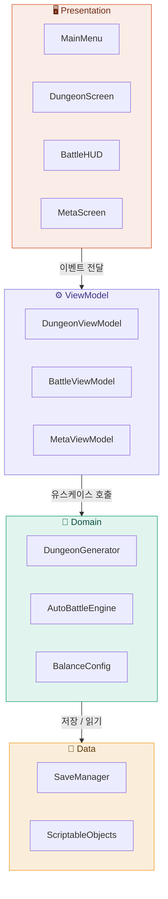
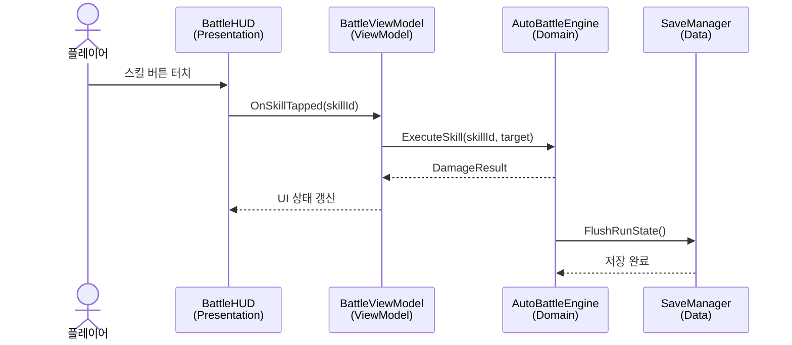

# Architecture

## 앱 목적

자동전투로 진행되는 로그라이크 던전 RPG.  
플레이어의 판단(스킬 발동·타겟 지정)이 결과를 결정한다.

---

## 전체 레이어 구조



---

## 사용자 액션 흐름

> 플레이어가 전투 중 스킬을 발동하는 순간



---

## 디렉토리 구조

```
Assets/
├── Scenes/                     # Presentation
│   ├── MainMenu.unity
│   ├── Dungeon.unity
│   └── MetaProgress.unity
├── UI/                         # Presentation
│   ├── BattleHUD.prefab
│   └── RunResult.prefab
├── Scripts/
│   ├── ViewModels/             # ViewModel
│   │   ├── BattleViewModel.cs
│   │   ├── DungeonViewModel.cs
│   │   └── MetaViewModel.cs
│   ├── Domain/                 # Domain
│   │   ├── AutoBattleEngine.cs
│   │   ├── DungeonGenerator.cs
│   │   └── BalanceConfig.cs
│   └── Data/                   # Data
│       ├── SaveManager.cs
│       └── MetaUnlockData.cs
└── SO/                         # ScriptableObject
    ├── CharacterDataSO.asset
    ├── SkillDataSO.asset
    └── RelicDataSO.asset
```

---

## 새 기능 추가 시 파일 위치

| 추가하려는 것 | 위치 |
|-------------|------|
| 새 화면 / UI | `Assets/Scenes` 또는 `Assets/UI` |
| 화면 상태·흐름 로직 | `Assets/Scripts/ViewModels` |
| 게임 규칙·밸런스 수치 | `Assets/Scripts/Domain` |
| 저장·불러오기·SO 정의 | `Assets/Scripts/Data` 또는 `Assets/SO` |

---

## 미결 이슈

- [ ] 씬 전환 방식 — Additive Load vs Single Load
- [ ] 던전 생성 알고리즘 — BSP vs Cellular Automata
- [ ] 이펙트 성능 예산 결정
