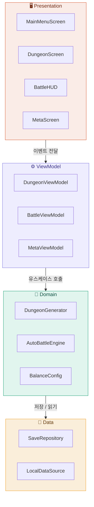
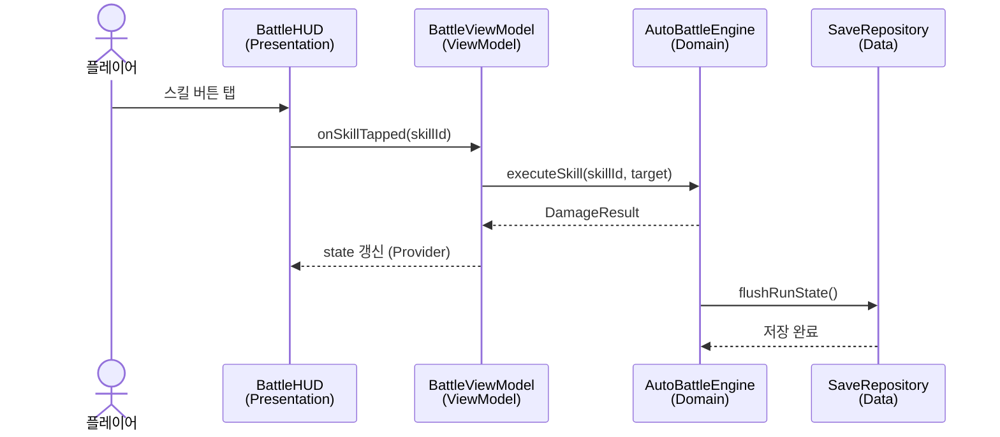

# Architecture

## 앱 목적

자동전투로 진행되는 로그라이크 던전 RPG.
플레이어의 판단(스킬 발동·타겟 지정)이 결과를 결정한다.

---

## 플랫폼

**Flutter (Dart)** — iOS / Android 동시 지원
- 근거: [ADR-0001](./../.planning/decisions/ADR-0001-mobile-framework.md)

---

## 레이어 구조



---

## 사용자 액션 흐름

> 플레이어가 전투 중 스킬을 발동하는 순간



---

## 디렉토리 구조

```
lib/
├── main.dart
├── app.dart
├── presentation/             # Presentation
│   ├── screens/
│   │   ├── main_menu_screen.dart
│   │   ├── dungeon_screen.dart
│   │   └── meta_screen.dart
│   └── widgets/
│       └── battle_hud.dart
├── application/              # ViewModel
│   ├── battle_view_model.dart
│   ├── dungeon_view_model.dart
│   └── meta_view_model.dart
├── domain/                   # Domain
│   ├── auto_battle_engine.dart
│   ├── dungeon_generator.dart
│   └── balance_config.dart
└── data/                     # Data
    ├── save_repository.dart
    └── local_data_source.dart
```

---

## 새 기능 추가 시 파일 위치

| 추가하려는 것 | 위치 |
|-------------|------|
| 새 화면 | `lib/presentation/screens/` |
| 화면 상태·흐름 로직 | `lib/application/` |
| 게임 규칙·밸런스 수치 | `lib/domain/` |
| 저장·불러오기 | `lib/data/` |

---

## 미결 이슈

- [ ] 상태관리 라이브러리 확정 — Provider vs Riverpod (ADR-0002)
- [ ] 로컬 저장 방식 확정 — SharedPreferences vs Hive (ADR-0003)
- [ ] 던전 생성 알고리즘 — BSP vs Cellular Automata
