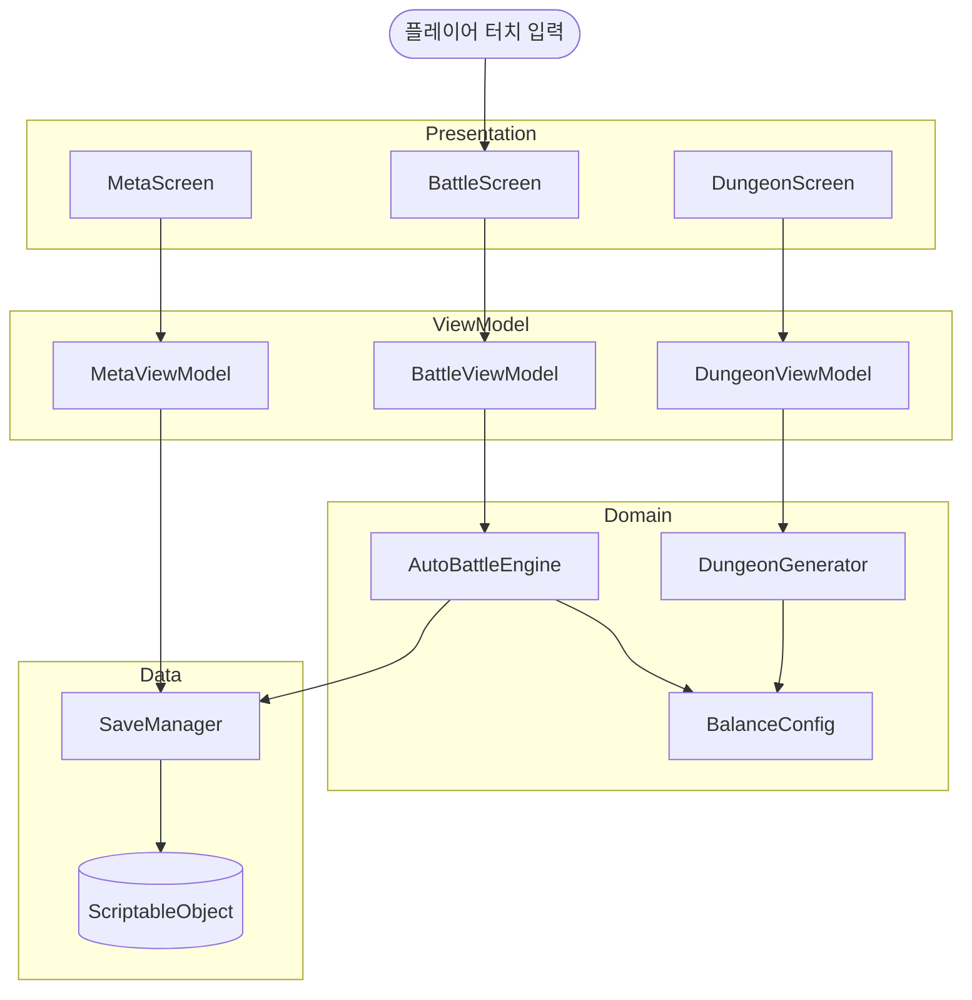

# Architecture

## 앱 목적

자동전투로 진행되는 로그라이크 던전 RPG — 플레이어의 판단(스킬 발동·타겟 지정)이 결과를 결정한다.

---

## 레이어 구조

Layered Architecture + MVVM 패턴 채택. (근거: ADR-0002)

| 레이어 | 역할 | 이 게임 예시 | Unity 폴더 |
|--------|------|------------|-----------|
| **Presentation** | 화면 렌더링·유저 입력 | 전투 UI, 던전 맵, 메타 진행 화면 | `Assets/Scenes`, `Assets/UI` |
| **ViewModel** | 상태 관리·화면 로직 | BattleViewModel, DungeonViewModel | `Assets/Scripts/ViewModels` |
| **Domain** | 핵심 게임 비즈니스 규칙 | 자동전투 엔진, 절차적 던전 생성 | `Assets/Scripts/Domain` |
| **Data** | 저장·불러오기·데이터 정의 | SaveManager, ScriptableObject | `Assets/Scripts/Data`, `Assets/SO` |

> 의존성 방향: Presentation → ViewModel → Domain → Data (역방향 금지)

---

## 시스템 다이어그램



---

## 사용자 액션 → 저장까지 흐름

**예시: 플레이어가 전투 중 스킬을 발동**

```
1. BattleScreen.cs      [Presentation]  터치 입력 이벤트 수신
        ↓
2. BattleViewModel.cs   [ViewModel]     스킬 발동 가능 여부 판단, 쿨타임 상태 갱신
        ↓
3. AutoBattleEngine.cs  [Domain]        데미지 계산, 버프/디버프 적용, 타겟 선정 로직
        ↓
4. SaveManager.cs       [Data]          런 결과 JSON 저장, 메타 해금 데이터 갱신
```

---

## 디렉토리 구조

```
Assets/
├── Scenes/                     # Presentation — 씬 파일
│   ├── MainMenu.unity
│   ├── Dungeon.unity
│   └── MetaProgress.unity
├── UI/                         # Presentation — UI Prefab
│   ├── BattleHUD.prefab
│   └── RunResult.prefab
├── Scripts/
│   ├── ViewModels/             # ViewModel
│   │   ├── BattleViewModel.cs
│   │   ├── DungeonViewModel.cs
│   │   └── MetaViewModel.cs
│   ├── Domain/                 # Domain — 핵심 게임 규칙
│   │   ├── AutoBattleEngine.cs
│   │   ├── DungeonGenerator.cs
│   │   └── BalanceConfig.cs
│   └── Data/                   # Data — 저장·SO
│       ├── SaveManager.cs
│       └── MetaUnlockData.cs
└── SO/                         # ScriptableObject 데이터 정의
    ├── CharacterDataSO.asset
    ├── SkillDataSO.asset
    └── RelicDataSO.asset
```

---

## 새 기능 추가 시 파일 위치 판단

| 추가하려는 것 | 위치 | 예시 |
|-------------|------|------|
| 새 화면 / UI | `Assets/Scenes` 또는 `Assets/UI` | `DungeonResultScreen.unity` |
| 화면 상태·흐름 로직 | `Assets/Scripts/ViewModels` | `MetaProgressViewModel.cs` |
| 게임 규칙·밸런스 수치 | `Assets/Scripts/Domain` | `DungeonGenerator.cs` |
| 저장·불러오기·데이터 정의 | `Assets/Scripts/Data` 또는 `Assets/SO` | `SaveManager.cs` |

---

## 미결 설계 이슈

- [ ] 씬 전환 방식 — Additive Load vs Single Load 결정 필요
- [ ] 던전 생성 알고리즘 — BSP vs Cellular Automata 비교 후 결정
- [ ] 이펙트·파티클 — 성능 예산 결정 후 품질 수준 확정
